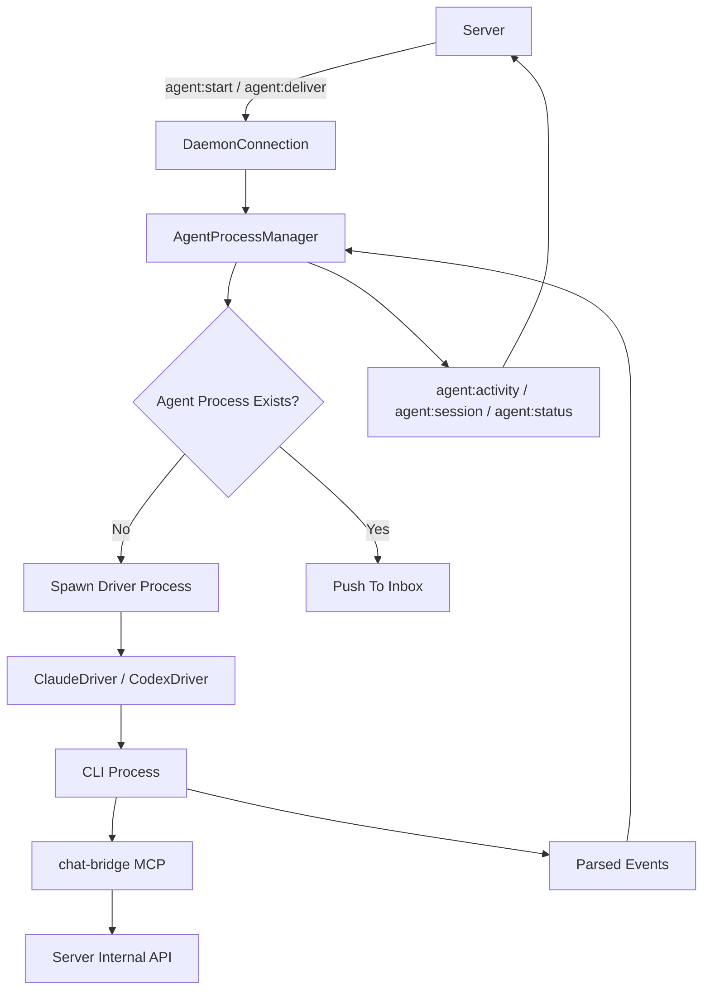
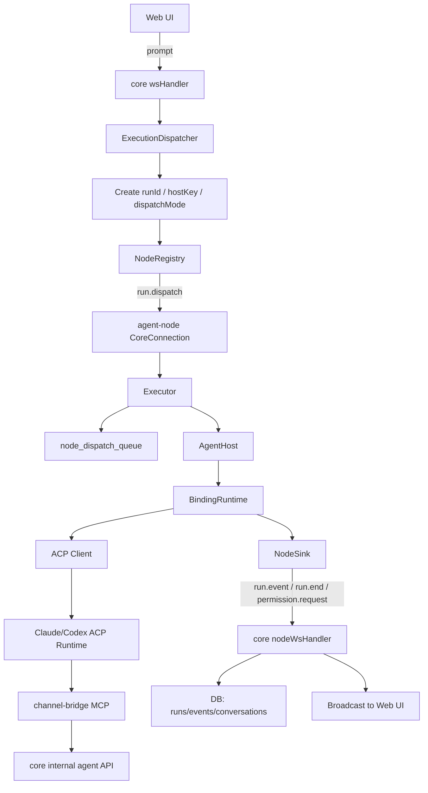
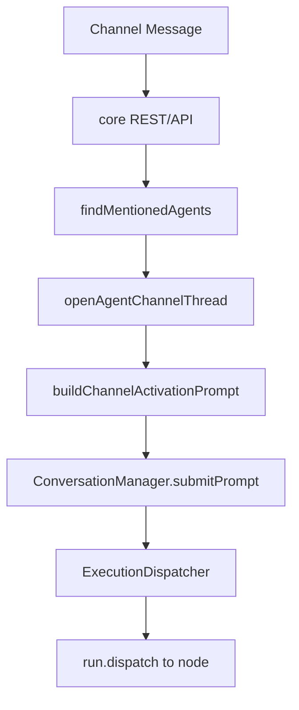
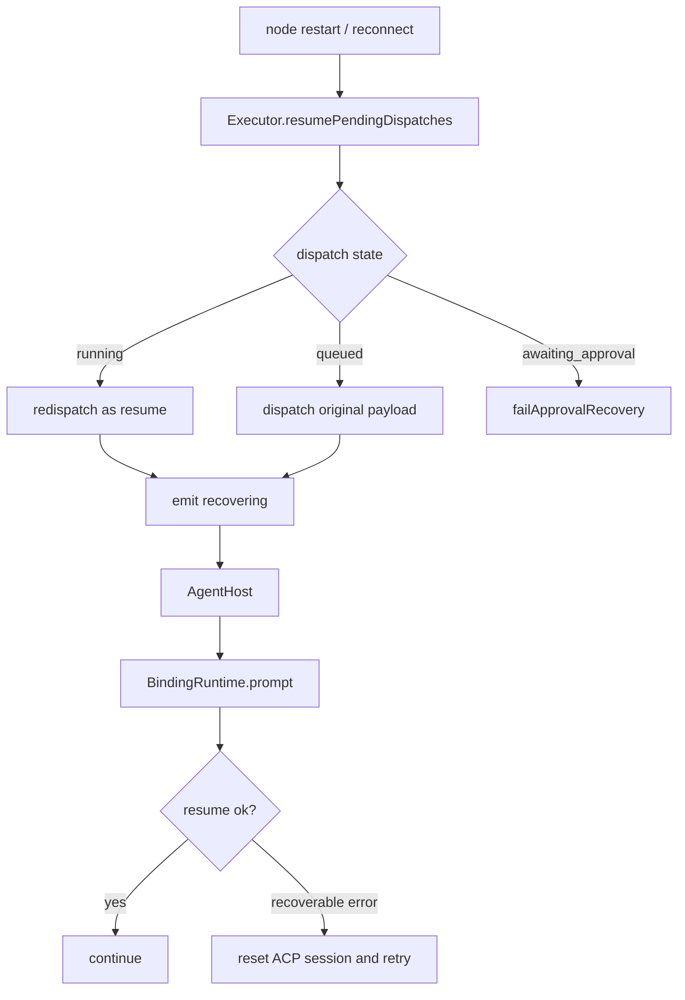

# Agent Collab vs Slock

本文分析当前仓库 `agent-collab` 的架构与系统设计，并对比参考实现 `@slock-ai/daemon@latest`。

对比基线：

- Agent Collab：当前工作区 `/ai/code/agi/agent-collab`
- Slock：npm `@slock-ai/daemon@0.28.0`
- 参考产物：
  - `/tmp/slock-daemon-inspect/unpack/package/dist/index.js`
  - `/tmp/slock-daemon-inspect/unpack/package/dist/chat-bridge.js`

---

## 一句话结论

Agent Collab 不是简单复刻 Slock，而是在继承其“长期存活 agent + MCP chat bridge + workspace memory”思路的基础上，向更平台化的方向演进：

- Slock 更像一个 **agent 进程管理器**
- Agent Collab 更像一个 **多节点控制平面 + 远端执行面 + ACP 运行时平台**

最核心的偏移是：

- Slock 的中心抽象是 `Agent Process`
- Agent Collab 的中心抽象是 `Agent Identity + Conversation Host + Run`

这让 Agent Collab 在多机调度、历史回放、状态恢复、前端可观测性上明显强于 Slock，但也引入了更复杂的状态同步与一致性成本。

---

## 参考材料

### Agent Collab 关键入口

- [`apps/core/src/main.ts`](../apps/core/src/main.ts)
- [`apps/core/src/execution/executionDispatcher.ts`](../apps/core/src/execution/executionDispatcher.ts)
- [`apps/core/src/web/nodeWsHandler.ts`](../apps/core/src/web/nodeWsHandler.ts)
- [`apps/agent-node/src/executor.ts`](../apps/agent-node/src/executor.ts)
- [`apps/agent-node/src/agentHost.ts`](../apps/agent-node/src/agentHost.ts)
- [`packages/runtime-acp/src/gateway/bindingRuntime.ts`](../packages/runtime-acp/src/gateway/bindingRuntime.ts)
- [`packages/channel-bridge/src/index.ts`](../packages/channel-bridge/src/index.ts)
- [`packages/memory/src/systemPrompt.ts`](../packages/memory/src/systemPrompt.ts)
- [`architecture/overview.md`](./overview.md)

### Slock 关键入口

- [`/tmp/slock-daemon-inspect/unpack/package/dist/index.js`](/tmp/slock-daemon-inspect/unpack/package/dist/index.js)
- [`/tmp/slock-daemon-inspect/unpack/package/dist/chat-bridge.js`](/tmp/slock-daemon-inspect/unpack/package/dist/chat-bridge.js)

---

## Agent Collab 当前架构

从系统边界看，Agent Collab 已经拆成 4 层：

1. `apps/core`
   - 控制平面
   - REST / WebSocket / 持久化 / 调度 / 节点注册 / 历史回放
2. `apps/agent-node`
   - 远端执行宿主
   - 管理 host、runtime、恢复、workspace
3. `packages/runtime-acp`
   - ACP 运行时抽象层
   - 统一 Claude / Codex 的 session、prompt、event、permission、cancel
4. `packages/channel-bridge` + `packages/memory` + `apps/web`
   - 协作层与产品层
   - 负责 MCP chat tools、memory prompt、前端体验

### 核心对象模型

当前仓库的产品语义已经比较稳定：

- `Machine`
  - 一台远端执行节点
- `Agent`
  - 长期唯一身份
- `Conversation`
  - 某个 agent 的 direct thread 或 branch thread
- `Run`
  - 某次实际执行
- `Host`
  - conversation 级别的长期 runtime 宿主

也就是说，Agent 是“身份层”，Conversation/Host 是“执行层”。

---

## Slock 当前架构

Slock daemon 的核心结构更集中：

1. `DaemonConnection`
   - 与 server 建立 WebSocket
   - 收 `agent:start / agent:deliver / agent:stop`
2. `AgentProcessManager`
   - 为每个 agent 管理进程、sessionId、inbox、workspace
   - 处理启动、停止、自动唤醒、stdin 通知
3. runtime drivers
   - `ClaudeDriver`
   - `CodexDriver`
4. `chat-bridge`
   - 暴露 MCP 工具到 server 内部 API

Slock 的中心抽象是：

- 一个 agent 对应一个 workspace
- 一个 agent 对应一个 CLI session
- 一条消息到达后，投递给 agent 继续工作

也就是说，Slock 是明显的 agent-centric 设计。

---

## 模块对照表

| 维度 | Slock | Agent Collab | 结论 |
|---|---|---|---|
| 控制面 | server + daemon 轻协议 | `core` 独立控制平面 | Agent Collab 更平台化 |
| 执行宿主 | `AgentProcessManager` | `Executor` + `AgentHost` | Agent Collab 拆分更细 |
| runtime 抽象 | driver 直接适配 CLI | `runtime-acp` 统一抽象 ACP | Agent Collab 更可扩展 |
| 协作桥 | `chat-bridge.js` | `channel-bridge` | 基本继承但语义更严格 |
| memory | workspace + MEMORY.md | workspace + MEMORY.md + context injection | Agent Collab 更系统化 |
| 状态持久化 | 主要围绕 agent/session/activity | `sessions/bindings/runs/events/...` 完整状态机 | Agent Collab 更可回放 |
| 恢复粒度 | agent/session 级 | node queue + host + run 级 | Agent Collab 更强 |
| UI 模型 | 更偏消息驱动 | Machine/Agent/Conversation 明确建模 | Agent Collab 产品化更强 |

---

## 核心设计对比

### 1. 中心抽象

#### Slock

Slock 的运行核心是“一个 agent 一个进程/会话”：

- 进程起来后维护 `sessionId`
- Claude 支持 stdin 通知继续收消息
- Codex 不支持 stdin，就 turn 结束后退出，收到新消息再自动拉起

这套模型很直接，适合“长期在聊天系统里待命的 agent”。

#### Agent Collab

Agent Collab 改成了“双层抽象”：

- `Agent` 表示长期身份
- `Conversation` 表示具体上下文
- `AgentHost` 绑定到 `conversation:{conversationId}:{agentType}`
- `Run` 表示某次执行

这意味着：

- 一个 agent 可以有 direct 主线程，也可以有 branch 线程
- 线程之间能共享 agent 身份，但执行状态是分离的
- host 是 conversation 级别复用，而不是 agent 级别复用

这是本仓库最重要的结构差异。

### 2. 执行模型

#### Slock：消息驱动执行

Slock 的主入口是：

- server 说“给某 agent 投递一条消息”
- daemon 把消息塞进 agent inbox
- agent 继续处理，处理完后空闲/退出

它更像“异步消息 worker”。

#### Agent Collab：显式 run 调度

Agent Collab 的主入口是：

- 前端对某个 conversation 发 `prompt`
- `ExecutionDispatcher` 生成 `runId`
- core 下发 `run.dispatch`
- node 落盘到 `node_dispatch_queue`
- `AgentHost` 驱动 `BindingRuntime.prompt()`
- node 把 `run.event / run.end` 流回 core

它更像“显式调度执行引擎”。

### 3. 恢复与容错

#### Slock

Slock 有恢复，但更偏运行时层：

- 进程空闲退出后，保存 config/sessionId
- 来新消息时自动 restart
- Claude 可通过 stdin 继续投递
- Codex 依赖“退出后重拉”

但它没有完整的 run/event 级数据库状态机。

#### Agent Collab

Agent Collab 的恢复是多层的：

- core 启动时收敛 stale node / stale conversation
- node 收 dispatch 时写 `node_dispatch_queue`
- node 重启后恢复 pending dispatch
- `BindingRuntime` 对 resume 错误有 retry/reset session 逻辑
- 前端可见 `recovering` 状态

这是平台化系统和“守护进程工具”的明显差异。

### 4. 可观测性与回放

#### Slock

Slock 向 server 上报的是摘要式事件：

- `agent:status`
- `agent:activity`
- `agent:session`

这对于“看 agent 是否在线、在干什么”足够，但不适合精确回放。

#### Agent Collab

Agent Collab 把 run 中的细粒度事件都持久化：

- `content.delta`
- `thinking.delta`
- `tool.call`
- `tool.result`
- `turn.begin`
- `turn.end`

这样前端可以做：

- 历史重放
- Activity timeline
- tool duration
- recovering 后同一 turn 续接

这属于更完整的执行审计模型。

### 5. 协作语义与消息模型

#### Slock

Slock 的 prompt 强调：

- 收到消息后复用原始 `target`
- `msg=` 可以拿来开 thread
- 主流程仍然以 channel/DM 消息投递为主

这个模型更接近“聊天系统原生线程语义”。

#### Agent Collab

Agent Collab 明显收紧了这部分语义：

- direct chat 默认只有一个 primary thread
- `send_message(content="...")` 默认回复当前会话
- 不鼓励因为 `msg=` 存在就自动开 thread
- channel mention / thread reply 会转成显式 activation prompt
- 触发消息作为 `[Triggered message metadata/body]` 注入

这是一种“对模型更友好的路由约束”，优点是减少模型误用 thread，缺点是离原生 chat target 语义稍远一些。

### 6. runtime 适配层

#### Slock

Slock 的 runtime driver 直接贴着 CLI：

- Claude driver 自己构造 `claude` 命令行
- Codex driver 自己构造 `codex exec`
- 自己解析各家 stdout JSON

优点是简单直接。

缺点是：

- 运行时差异直接泄漏到 daemon
- 扩展更多 runtime 时维护成本会上升

#### Agent Collab

Agent Collab 用 `runtime-acp` 把 CLI 侧差异压到了 ACP client 层：

- session 初始化
- prompt blocks
- tool updates
- permission
- cancel
- load/resume

`core` 和 `agent-node` 上层看到的是统一抽象，而不是 Claude/Codex 各自的原始输出格式。

这是比 Slock 更成熟的一步。

### 7. 数据模型

#### Slock

从 daemon 发布包看，Slock 的状态更偏运行中内存对象：

- `agents`
- `idleAgentConfigs`
- `startingInboxes`
- `sessionId`
- `activity`

它当然背后有 server 侧状态，但 daemon 这个包自身不是一个重数据库状态机。

#### Agent Collab

Agent Collab 的 runtime/product 状态几乎都在 SQLite 中有落点：

- runtime：`sessions / bindings / runs / events`
- product：`nodes / agents / conversations / channels / channel_messages / tasks`
- recovery：`node_dispatch_queue / conversation_prompt_queue`

这一点非常像“执行平台”而不是“agent 守护进程”。

---

## 主流程对比

### 1. Slock 主流程

特点：

- 入口是 agent message delivery
- daemon 直接管理 agent 进程
- activity 是摘要事件

### 2. Agent Collab 主流程

特点：

- 入口是 conversation run dispatch
- 执行面和控制面完全分离
- 事件与状态持久化完整

### 3. Agent Collab 的 channel mention 激活流程

这一步很关键，因为它说明：

- 频道协作在产品上存在
- 但执行入口仍被统一折叠回 conversation run

### 4. Agent Collab 的恢复流程

---

## 关键继承点

下面这些设计明显是从 Slock 继承来的：

1. `MEMORY.md + notes/` 的 workspace memory 习惯
2. `chat` MCP bridge 作为唯一通信接口
3. “长期存活 agent，不要直接输出文本，必须用 send_message”
4. task board 语义
5. system prompt 大结构
6. Claude / Codex 双 runtime 适配思路

对应代码：

- [`packages/channel-bridge/src/index.ts`](../packages/channel-bridge/src/index.ts)
- [`packages/memory/src/systemPrompt.ts`](../packages/memory/src/systemPrompt.ts)

---

## 关键偏移点

下面这些是 Agent Collab 相对 Slock 的实质性创新：

1. **remote-only 架构**
   - core 不本地执行 agent，统一走远端 node
2. **conversation host 化**
   - host 从 agent 级变成 conversation 级
3. **run/event 持久化**
   - 不只看 activity，而是完整记录执行过程
4. **前端显式产品模型**
   - Machine / Agent / Conversation / Workspace / Profile / Activity
5. **agent 级串行调度**
   - 多 thread 不并行
6. **双队列恢复机制**
   - `node_dispatch_queue`
   - `conversation_prompt_queue`
7. **ACP 统一运行时抽象**
   - 上层不直接感知 Claude/Codex 原始输出协议

---

## 设计优劣势

### Agent Collab 相对 Slock 的优势

- 更适合多机、多节点、统一调度
- 更适合做完整前端产品
- 更适合做执行历史回放和可观测性
- 更适合未来接更多 runtime
- 更适合精细化恢复与运维

### Agent Collab 相对 Slock 的代价

- 状态复杂度显著更高
- core DB、node DB、ACP session、message checkpoint 之间的一致性更难维护
- 调试链路更长
- 在一些简单协作场景下，系统重量高于 Slock

### Slock 的优势

- 结构直接
- agent-centric 心智模型简单
- daemon 代码对“消息到达 -> agent 处理”非常自然
- 作为协作 agent 基础设施，启动成本低

### Slock 的限制

- 不像 Agent Collab 这样天然支持强状态产品化
- 可回放性和执行级审计偏弱
- conversation/thread 作为执行实体不够显式
- runtime 差异更多暴露在 daemon 层

---

## 我的判断

如果目标是：

- 做一个“团队里常驻的协作 agent 守护进程”
- 强调聊天驱动、轻量部署、简单唤醒

那么 Slock 的设计更轻、更直接。

如果目标是：

- 做一个“多机多 agent 协作平台”
- 要有前端、节点管理、会话管理、回放、恢复、工作区浏览

那么 Agent Collab 的方向明显更对。

简化地说：

- Slock 是一个很好的 **参考原型**
- Agent Collab 正在变成一个 **执行平台**

---

## 当前仓库需要注意的点

### 1. 文档存在版本漂移

数据库文档还写的是 v20，但代码里的 migration 已经到 v26：

- 文档：[`architecture/database.md`](./database.md)
- 实际：[`packages/runtime-acp/src/db/migrations.ts`](../packages/runtime-acp/src/db/migrations.ts)

这说明文档层已经落后于实现，后续应补齐。

### 2. 权限系统目前更像“展示型控制”，不是强隔离边界

`BindingRuntime` 里默认仍然倾向 auto-allow，大量 permission 分支会自动放过。这意味着：

- 当前更接近“产品层可见审批”
- 还不是严格安全沙箱

### 3. 三层串行化保证了稳态，但吞吐偏保守

当前同时存在：

- agent 级串行
- host inbox 串行
- runtime queue 串行

优点是简单可靠。
缺点是当后续想做真正并行协作时，会需要重新拆账。

---

## 最终结论

Agent Collab 对 Slock 的继承主要在协作语义层：

- chat bridge
- MEMORY.md
- agent system prompt
- task board
- 长期 agent 心智模型

Agent Collab 对 Slock 的超越主要在平台层：

- 控制面 / 执行面分离
- conversation 级 host
- 完整 run/event 持久化
- 更强恢复
- 更清晰前端产品模型

因此，最准确的描述不是“Agent Collab 参考了 Slock 的实现细节”，而是：

> Agent Collab 以 Slock 的协作 agent 设计为起点，重构成了一个面向多节点远端执行的 agent orchestration 平台。
